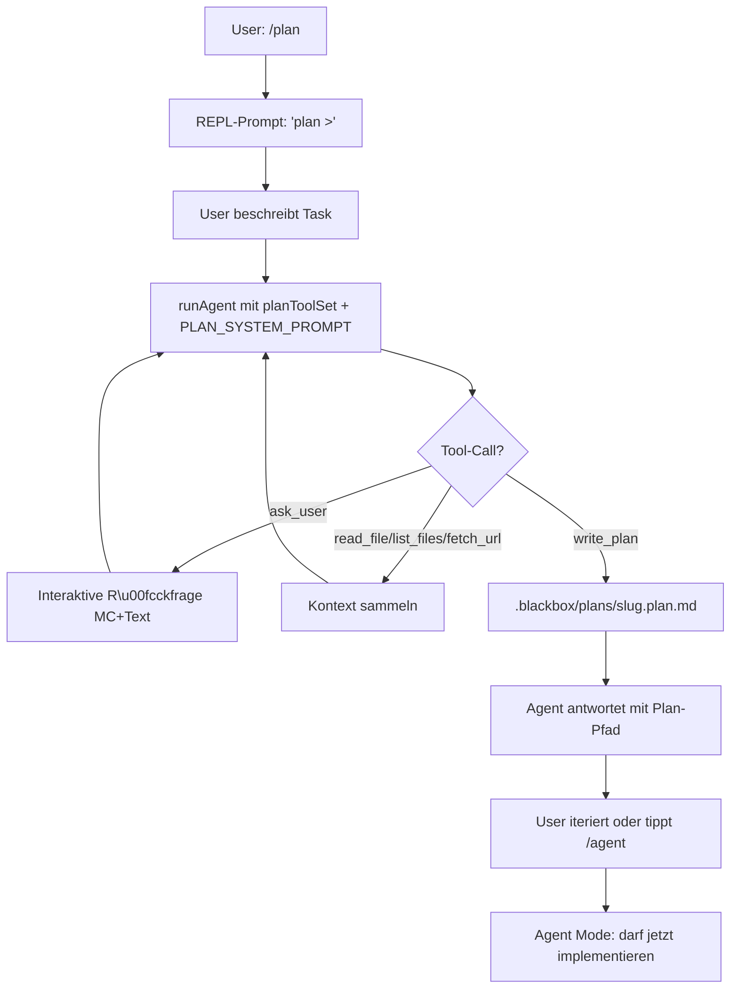

# Plan Mode für blackbox

Ein read-only Modus analog zu Cursors Plan Mode. Agent darf nur lesen, stellt Rückfragen an den User (MC + Freitext) und produziert am Ende eine committbare Markdown-Datei unter `.blackbox/plans/<slug>.plan.md`.

## Kernidee

- Neuer Modus-State `"agent" | "plan"` in der REPL.
- Eigener System-Prompt + eingeschränktes Tool-Set, wenn der Agent-Loop läuft.
- Zwei neue Tools: `ask_user` (interaktive Rückfrage) und `write_plan` (nur in `.blackbox/plans/*.plan.md`).
- `edit_file` und `execute_bash` sind im Plan Mode deaktiviert. `read_file`, `list_files`, `fetch_url`, `openrouter:web_search`, `openrouter:datetime` bleiben.

## Flow



## Dateien und Änderungen

### 1. [src/config.ts](src/config.ts) — Konstanten und Plan-Prompt

- Neu: `PLANS_DIR = ".blackbox/plans"`, `PLAN_FILE_SUFFIX = ".plan.md"`, `PLAN_DONE_SUFFIX = ".plan.done.md"`.
- Neu: `PLAN_SYSTEM_PROMPT`. Kernanweisungen an das Modell:
  - Du bist im Plan Mode; keine Writes, keine Shell.
  - **Zuerst Rückfragen** via `ask_user` stellen, wenn die Anforderung mehrdeutig ist (max. 1–2 Fragen pro Call, MC wenn möglich).
  - Danach relevanten Code via `read_file`/`list_files` erforschen.
  - Am Ende **genau einmal** `write_plan` mit strukturierter Markdown-Datei aufrufen (Sections: Goal, Affected Files, Steps, Open Questions, Test Plan).
  - **Der Plan-Inhalt wird grundsätzlich auf Englisch verfasst.** Ausnahme: der User verlangt explizit eine andere Sprache (z. B. „schreib den Plan auf Deutsch"). In dem Fall wird die gewünschte Sprache für Sections und Fließtext verwendet. Rückfragen via `ask_user` dürfen weiterhin in der User-Sprache gestellt werden, damit sie natürlich wirken.
  - Ausgabe nach `write_plan`: kurzer Hinweis auf den Pfad, keine Implementierung.

### 2. [src/tools.ts](src/tools.ts) — Tool-Set aufsplitten

Bisher gibt es eine flache Liste `TOOL_SCHEMAS`. Umbauen zu:

- `READ_TOOL_SCHEMAS`: `read_file`, `list_files`, `fetch_url`, `openrouter:web_search`, `openrouter:datetime`.
- `WRITE_TOOL_SCHEMAS`: `edit_file`, `execute_bash`.
- `AGENT_TOOL_SCHEMAS = [...READ_TOOL_SCHEMAS, ...WRITE_TOOL_SCHEMAS]` (bestehendes Verhalten).
- `PLAN_TOOL_SCHEMAS = [...READ_TOOL_SCHEMAS, ask_user_schema, write_plan_schema]`.

Handler:
- `write_plan(args: { slug, title, content })` — schreibt `.blackbox/plans/<slug>.plan.md`. Slug wird gesäubert (kebab-case, nur `[a-z0-9-]`), Datei bekommt automatisch `# <title>`-Header falls fehlend. Erstellt Ordner via `fs.mkdir(..., { recursive: true })`. Nutzt `assertInside` damit Pfad im Workspace bleibt.
- `ask_user` wird **nicht** in `TOOL_REGISTRY` von `tools.ts` registriert, weil es Zugriff auf `readline` + `selectFromList` braucht. Stattdessen wird der Handler per Dependency-Injection in den Agent-Loop gereicht (siehe nächster Punkt).

Tool-Schema für `ask_user`:

```json
{
  "type": "function",
  "function": {
    "name": "ask_user",
    "description": "Stelle dem User eine kurze Klarstellungsfrage. Nutze 'choice' f\u00fcr MC (2-6 Optionen), sonst 'text' f\u00fcr Freitext.",
    "parameters": {
      "type": "object",
      "properties": {
        "question": { "type": "string" },
        "type": { "type": "string", "enum": ["choice", "text"] },
        "options": {
          "type": "array",
          "items": { "type": "string" },
          "description": "Nur bei type=choice, 2-6 Eintr\u00e4ge."
        }
      },
      "required": ["question", "type"]
    }
  }
}
```

### 3. [src/agent.ts](src/agent.ts) — Tool-Set + askUser-Callback parametrisieren

- `runAgent` bekommt zwei neue optionale Parameter:
  - `toolSchemas: AnyTool[]` (statt hartkodiert `TOOL_SCHEMAS`).
  - `askUser?: (q: { question: string; type: "choice" | "text"; options?: string[] }) => Promise<string>`.
- System-Prompt wird bereits via `buildInitialHistory` gesetzt — wir ziehen das raus und lassen den Caller den Prompt über ein Argument `systemPrompt` oder über vorinitialisierte History übergeben.
- Im Tool-Dispatch: wenn der Name `ask_user` ist und `askUser` vorhanden, diesen Callback aufrufen, sonst Fehler-Result zurückgeben. Analog für `write_plan`: bleibt in `tools.ts`, braucht keinen Callback.
- Reporter (`onToolCall`/`onToolResult`) funktioniert unverändert; Plan-Mode-spezifische Darstellung läuft über den Spinner in [src/index.ts](src/index.ts).

### 4. [src/index.ts](src/index.ts) — REPL-Integration

- State: `let mode: "agent" | "plan" = "agent";`.
- Neue Slash-Commands:
  - `/plan` → `mode = "plan"`, History resetten auf Plan-System-Prompt (damit der alte Verlauf das Modell nicht in Implementierungs-Muster zieht); Ausgabe z. B. `Plan mode aktiv. /agent zum Verlassen.`
  - `/agent` → `mode = "agent"`, History resetten auf normalen System-Prompt.
  - `/plans` → listet **nur** offene Pläne (`.blackbox/plans/*.plan.md`), keine `*.plan.done.md`.
  - `/plans all` → listet zusätzlich erledigte Pläne (`*.plan.done.md`) mit sichtbarem `done`-Marker.
  - `/plan done <slug>` → benennt `.blackbox/plans/<slug>.plan.md` in `.blackbox/plans/<slug>.plan.done.md` um. Fehlermeldung wenn bereits erledigt oder nicht gefunden. Akzeptiert auch den vollen Dateinamen statt Slug.
- Prompt-Prefix wird abhängig vom Mode gesetzt: `> ` für Agent, magenta `plan > ` für Plan.
- `/help` und `/reset` aktualisieren.
- Beim `runAgent`-Aufruf:
  - Agent Mode: `toolSchemas = AGENT_TOOL_SCHEMAS`, kein `askUser`.
  - Plan Mode: `toolSchemas = PLAN_TOOL_SCHEMAS`, `askUser = makeAskUser(rl)`.

`makeAskUser(rl)` in [src/index.ts](src/index.ts):
- Pausiert Spinner, pausiert `rl`.
- Bei `type === "choice"`: nutzt das vorhandene `selectFromList` aus [src/select.ts](src/select.ts) — liefert bereits alles was wir brauchen (Pfeiltasten + Enter).
- Bei `type === "text"`: `rl.question(...)`.
- Gibt einen String zurück, der als Tool-Result (JSON oder Plaintext) in den Loop fließt, z. B. `{"answer": "..."}`.
- Wichtig: Spinner stop/start um die Interaktion herum, sonst flackert der Output.

### 5. [README.md](README.md) — kurze Doku

- Neuen Abschnitt `## Plan mode` mit:
  - `/plan` aktivieren, `/agent` verlassen.
  - Ergebnis landet in `.blackbox/plans/<slug>.plan.md` und kann in Git committed werden.
  - Abgeschlossene Pläne werden via `/plan done <slug>` zu `<slug>.plan.done.md` umbenannt und verschwinden aus `/plans` (bleiben im Repo als History).
  - Beispiel-Flow (2–3 Zeilen).
- Tool-Tabelle um `ask_user` und `write_plan` ergänzen (als „plan-mode only").
- Slash-Command-Tabelle um `/plan`, `/agent`, `/plans`, `/plans all`, `/plan done <slug>` ergänzen.

### 6. Optional: [.gitignore](.gitignore)

- Sicherstellen, dass `.blackbox/plans/` **nicht** ignoriert wird (damit Pläne committbar sind). Falls `.blackbox/` ignoriert ist, gezielt per `!.blackbox/plans/` freischalten. Vor Umsetzung kurz prüfen, ob die Datei existiert / Einträge hat.

## Sicherheits-/Sandbox-Details

- `write_plan` ruft `assertInside` für den resultierenden Pfad auf; Slug wird vorher via Regex auf `[a-z0-9-]{1,64}` gezwungen — verhindert Path-Traversal.
- Kein `execute_bash`, kein `edit_file` im Plan-Tool-Set, daher harte Write-Garantie.
- `fetch_url` bleibt erlaubt (read-only), wie im Agent Mode.

## Nicht-Ziele in diesem Plan

- Keine automatische Ausführung eines Plans nach `/agent` (User promptet selbst, z. B. „implementiere .blackbox/plans/foo.plan.md").
- Keine Hotkey-Umschaltung wie Shift+Tab in Cursor — bewusst nur Slash-Commands, weil das zur bestehenden REPL passt.
- Keine Mehrfach-`ask_user`-Batching in einem Tool-Call; das Modell kann mehrere `ask_user` hintereinander aufrufen.