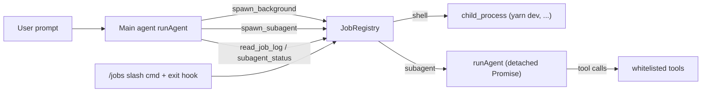

# Subagents & Background Jobs

Zwei parallele Job-Arten, ein gemeinsames Registry, non-blocking für den Main-Agent.

## Architektur



Zentrales `JobRegistry` hält zwei Job-Typen (`shell`, `subagent`) mit einheitlichem Interface: `id`, `status`, `logPath`, `result?`. Beide sind non-blocking: Tool-Aufrufe kehren mit `job_id` sofort zurück. Output wird gestreamt in Log-Dateien unter `os.tmpdir()/blackbox-<pid>/<id>.log` und stirbt mit der Session.

## Neue Dateien

### `src/jobs.ts` — JobRegistry + Shell-Jobs
- Interner Store `Map<id, JobRecord>` mit:
  - `JobRecord = { id, kind: "shell" | "subagent", status: "running" | "done" | "error" | "cancelled", startedAt, endedAt?, logPath, exitCode?, result?, child?: ChildProcess, abort?: AbortController }`
- `spawnShellJob(command)`: `spawn(command, { shell: true, detached: true, stdio: ["ignore", "pipe", "pipe"] })`, Output via Stream in Logfile (cap 10 MB), gibt `id` wie `job_3` zurück.
- `listJobs()`, `readJobLog(id, tail?)` (letzte N Zeilen/Chars), `killJob(id)` (SIGTERM, nach 2s SIGKILL, process group via `-pid` wie in bestehender `executeBashTool` in [src/tools.ts](src/tools.ts)).
- `killAll()` für Exit-Hook.
- Counter + Cleanup der Temp-Dir auf `process.on("exit")`.

### `src/subagents.ts` — Markdown-Agents + async Runner
- `loadAgents()`: Scannt `<workspace>/.blackbox/agents/*.md` und `~/.blackbox/agents/*.md` (Project überschreibt User bei Namenskonflikt). Parst YAML-Frontmatter manuell (simpel, kein neues npm-Dep) — Format analog pi-mono:
  ```
  ---
  name: scout
  description: Fast codebase recon
  tools: read_file, list_files, fetch_url
  model: anthropic/claude-sonnet-4.5
  ---
  System prompt hier...
  ```
- Validiert `tools`-Liste gegen `TOOL_REGISTRY` aus [src/tools.ts](src/tools.ts); unbekannte Tools → Fehler beim Load, nicht erst zur Runtime.
- `spawnSubagentJob(name, task, mainModel)`:
  - Holt AgentDef, baut Mini-History `[{role:"system", content: agent.systemPrompt}]`.
  - Startet **detached Promise** der `runAgent(history, task, agent.model ?? mainModel, reporter, abort.signal)` aus [src/agent.ts](src/agent.ts) aufruft.
  - Tool-Whitelist wird via neuem optionalen Param in `runAgent` oder via Wrapper-`TOOL_SCHEMAS` durchgereicht (siehe unten).
  - Reporter schreibt jeden Tool-Call + Ergebnis ins Job-Log.
  - Promise-Result → `job.result = answer`, Status `done`; bei throw → `status="error"`, `result = err.message`.
  - Gibt sofort `id` zurück — Main-Agent blockiert nicht.

### Kleine Änderung in `src/agent.ts`
`runAgent` bekommt optionalen Parameter `allowedTools?: Set<string>`, der `TOOL_SCHEMAS` und `TOOL_REGISTRY` filtert. Default = alle. Used by subagents für Whitelisting.

## Neue Tools (in `src/tools.ts`)

Alle als `function`-Tools registriert, Argumente in JSON-Schema. Ergebnisse sind immer knappe Textantworten (inkl. `job_id`) — Main-Agent polled selbst.

- `spawn_background(command)` → `"Started shell job <id> for: <command>"`
- `spawn_subagent(agent, task)` → `"Started subagent job <id> (agent=<name>)"`
- `list_jobs()` → Tabelle: `id | kind | status | runtime | command/agent`
- `list_subagents()` → verfügbare Agent-Definitionen (name + description)
- `read_job_log(id, tail?)` → letzte N Zeilen (default 200) aus Logfile
- `subagent_result(id)` → wenn `status="done"`: `result`; sonst aktueller Status + Hinweis später nochmal abzufragen
- `kill_job(id)` → SIGTERM

System-Prompt in [src/config.ts](src/config.ts) wird entsprechend ergänzt (kurze Beschreibung der neuen Tools + Hinweis: für lang laufende Prozesse wie Dev-Server `spawn_background` statt `execute_bash` nutzen).

## CLI-Integration (`src/index.ts`)

- **Exit-Hook**: `rl.on("close")` und im SIGINT-Exit-Pfad → `jobs.killAll()` vor `process.exit(0)`. Verhindert verwaiste `yarn dev` Prozesse.
- **Slash-Commands**:
  - `/jobs` — interaktiver Picker via bestehendem `selectFromList` aus [src/select.ts](src/select.ts); Enter zeigt Log-Tail + Status.
  - `/jobs kill <id>` — expliziter Kill.
  - `/agents` — listet geladene Subagent-Definitionen (hilfreich für Debugging von Markdown).
- **Reporter-Erweiterung**: Während ein Subagent läuft, optional eine Statuszeile im Spinner (`working… (2 bg jobs running)`) — nice to have, klein.

## Beispiel-Agent-Dateien
Eine minimale Default-Set als Vorlage anlegen unter `examples/agents/`:
- `scout.md` — read-only, schnelle Recon (`read_file, list_files, fetch_url`)
- `planner.md` — Plan-Erstellung, keine Write-Tools
- `worker.md` — alle Tools

Nicht autom. installiert; README zeigt wie man sie nach `.blackbox/agents/` kopiert.

## README-Update
Neue Sektionen für
- Background Jobs (`yarn dev` Beispiel)
- Subagents (Markdown-Format, Verzeichnisse, Beispiel-Workflow)
- Neue Slash-Commands in der Tabelle